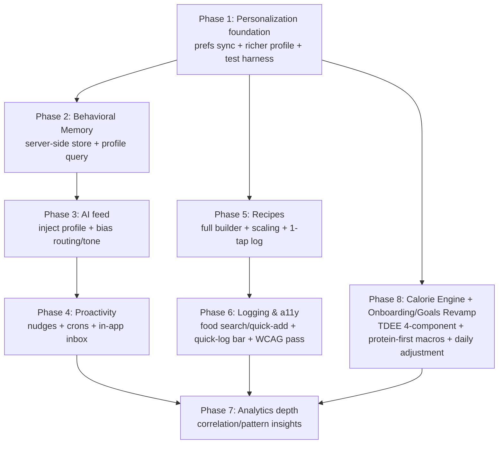

# Implementation Plan — Stride Adaptive Wellness Roadmap

**Branch:** `feature/adaptive-wellness-engine`
**Created:** 2026-05-29

---

## Problem Statement

Stride is a strong *reactive* wellness companion but falls short of the SYSTEM.md vision on the *adaptive/proactive* side, and its onboarding/goal math is a basic activity-multiplier TDEE. This roadmap closes the highest-impact gaps — server-side **Behavioral Memory** that feeds the AI, **proactivity/automation** (insight crons + in-app nudge inbox), a **full recipe builder**, the complete **personalization** stack, a **low-friction logging + accessibility** pass, **analytics depth** — and revamps **onboarding + daily goals** with a science-based **4-component calorie/macro engine**. Scope is the broad roadmap, sequenced by impact and dependency order.

---

## Requirements

- Scope: broad roadmap, sequenced by impact — **[1=c]**
- Cross-cutting priorities: server-side Behavioral Memory **and** proactivity/automation — **[2=a&b]**
- Recipes: full builder with servings + scaling; **hybrid** per-ingredient macros (search-backed via `foods.searchFoods` + nutrition engine, with manual override/add-custom) — **[recipe=c]**
- Personalization: all of — sync prefs to Convex → server-side behavioral memory → richer profile inputs — **[person=d]**
- Logging/a11y: combination — food-search + recent/quick-add UI, one-tap quick-log bar, accessibility pass — **[logging=d]**
- Proactivity: in-app nudge inbox via Convex cron now; records designed so web push can layer on later — **[1=c]**
- Behavioral memory feed: inject a compact behavior profile into AI context **and** bias coach routing + tone automatically — **[3=b]**
- Accessibility target: WCAG 2.1 AA on core flows (Home, Coach, logging, Settings)
- **Calorie engine revamp:** 4-component TDEE + protein-first macro engine (Mifflin-St Jeor / Katch-McArdle, MET-based NEAT/EAT, TEF ×1.10, goal adjustment with deficit cap + safety floors, dynamic per-day adjustment)

---

## Background (verified in code)

- **Schema** (`backend/convex/schema.ts`) has `users, meals, workouts, daily_goals, insights, weekly_summaries, user_profiles, user_settings, chat_sessions, chat_messages, food_cache, user_gamification, water_logs, sleep_logs, mood_logs, steps_logs, user_metabolic_profiles, calorie_feedback`. No `recipes`, `user_behavior`, `nudges`; **no `crons.ts`**.
- `user_profiles` already has `weight, height, age, sex, activityLevel, calorieTarget, proteinTarget, carbTarget, fatTarget, bodyFat, leanMass, goal, trainingStyle, dietaryPreference, allergies, fitnessLevel, …`. It does **not** have occupation/lifestyle/weekly-workout inputs the new engine needs.
- `user_settings` holds only `openRouterKey`/`openRouterModel`. UI prefs (units, notifications, coachingStyle, reduceMotion) are `localStorage`-only (`usePrefs`). Behavioral memory is `localStorage`-only (`useBehavior`, `lib/behavior.ts`) and not fed to the AI.
- **Existing TDEE:** `profile.calculateTDEE` is an action wired into `OnboardingPage.tsx`. It uses an activity multiplier, not the 4-component model. `daily_goals` is written via `goals.ts`.
- **Existing workout burn:** `backend/convex/calorie_engine.ts` computes per-session burn (MET + EPOC + adaptive metabolic factor); logged workouts store `caloriesBurned`. The new engine must not double-count this.
- **Food pipeline (reusable):** `foods.searchFoods` (cache→OFF→USDA), `foods.lookupBarcode`, `nutrition_engine`, `unit_converter`, `computeNutrition`. `searchFoods`/`getRecentFoods` are unused by the UI.
- **AI:** `ai.chat` (two-pass intent + `LOG_MEAL`); `coaches.classifyCoachType` is keyword-only; 7 personalities in `coaches.ts`. `insights.getTodayBrief` returns window-aware priority/nudge (wired into Home + Insights). `generateDailyInsights`/`generateWeeklySummary` exist but have no automated trigger.
- Settings UI is `SettingsPage` exported from `ProfilePage.tsx`. Meals carry optional `structuredItems`/`ingredientBreakdown` (reusable for recipe logging).
- No configured test runner. The plan establishes `vitest` (frontend: React Testing Library + axe; backend: `convex-test`).

---

## Architecture



---

## Data Model Changes (Convex)

### New tables

```
user_behavior  (userId, kind, key, value, date, ts)                      index: by_user, by_user_kind
recipes        (userId, name, servings, ingredients[json], perServing{kcal,p,c,f},
                total{kcal,p,c,f}, source)                               index: by_user
nudges         (userId, type, title, body, window, status, delivery,
                createdAt, dismissedAt, deepLink)                        index: by_user_status
```

### Extended tables

- `user_settings` → + `units`, `notifications`, `coachingStyle`, `reduceMotion`
- `user_profiles` (Phase 1) → + `dislikedFoods`, `cuisines`, `equipment`, `scheduleNote`
- `user_profiles` (Phase 8) → + `occupationType`, `workHoursPerDay`, `lifestyleActivity`, `weeklyWorkouts` (json), `goalWeightKg`, `planBreakdown` (json); `goal` enum widened to 7 engine goals
- `daily_goals` → written from computed plan; per-day row patched by dynamic adjustment

---

## Calorie Engine Architecture (Phase 8)

```
TDEE = BMR + NEAT_job + NEAT_lifestyle + EAT_workouts(avg/7)
finalTDEE = round(TDEE × 1.10)              # thermic effect of food
target = applyGoal(finalTDEE, goal)          # ±adjustment, deficit capped at 25%, floor 1500M/1200F
macros = proteinFirst(target, weightKg, goal)# protein g/lb by goal → fat g/lb → carbs fill remainder

BMR: Katch-McArdle if bodyFat% present, else Mifflin-St Jeor
NEAT/EAT: MET-based (calcMETCalories = (MET-1)×kg×h for NEAT; MET×kg×h for EAT)
Daily adjustment: delta = todayActualBurn − plannedDailyEAT → carbs absorb delta
  (todayActualBurn = sum of logged workouts' existing caloriesBurned for the day)
```

Module: pure functions in `backend/convex/tdee_engine.ts` (no Convex imports → unit-testable); exposed via `profile.ts` (`calculateNutritionPlan` compute + `upsertPlanFromOnboarding` persist); per-day adjustment via `goals.ts`/`insights.getTodayBrief`.

---

## Task Breakdown

### Phase 1 — Personalization foundation

#### Task 1: Test harness + settings persistence (prefs sync)

- **Objective:** Stand up a minimal `vitest` setup (frontend + `convex-test`), then extend `user_settings` with `units`, `notifications`, `coachingStyle`, `reduceMotion`; update `profile.getSettings`/`upsertSettings`; migrate `usePrefs` to read/write Convex with a `localStorage` write-through fallback (no call-site changes).
- **Files:** `backend/convex/schema.ts`, `backend/convex/profile.ts`, `frontend/src/hooks/usePrefs.ts`, `frontend/src/lib/storage.ts`, new `vitest.config.ts` (both packages).
- **Guidance:** Keep `usePrefs` API identical; hydrate from Convex, write through to both; validate enum-ish fields server-side. Never echo `openRouterKey`.
- **Tests:** `upsertSettings`→`getSettings` round-trip; invalid values rejected; `usePrefs` reflects server value; offline fallback works.
- **Demo:** Change coaching style/units on one client; reload (or second client) shows it persisted server-side.

#### Task 2: Richer profile inputs

- **Objective:** Add `dislikedFoods`, `cuisines`, `equipment`, `scheduleNote` to `user_profiles`; surface in Onboarding + Profile UI.
- **Files:** `backend/convex/schema.ts`, `backend/convex/profile.ts`, `frontend/src/pages/OnboardingPage.tsx`, `frontend/src/pages/ProfilePage.tsx`.
- **Guidance:** All optional; reuse `upsertProfile`; comma-separated strings to stay minimal. Coordinate with Phase 8 to avoid redundant migrations.
- **Tests:** Profile round-trip incl. new fields; UI renders + saves.
- **Demo:** Add disliked foods + equipment in Profile; values persist and display.

---

### Phase 2 — Behavioral Memory (server-side)

#### Task 3: Behavioral memory store

- **Objective:** Add `user_behavior` table + `recordBehavior` mutation; migrate `useBehavior`/`lib/behavior.ts` to write server-side (localStorage kept as offline cache + write-through).
- **Files:** `backend/convex/schema.ts`, new `backend/convex/behavior.ts`, `frontend/src/hooks/useBehavior.ts`, `frontend/src/lib/behavior.ts`.
- **Guidance:** Generic `(kind, key, value)` shape. Signals: window engagement, nudge dismissals, suggestion clicks, coach used, log timestamps.
- **Tests:** `recordBehavior` inserts; dismiss/suggestion-click persist; offline fallback works.
- **Demo:** Dismiss a window prompt / click a suggestion → row appears in Convex; persists across devices.

#### Task 4: Behavior profile aggregation query

- **Objective:** Add `getBehaviorProfile` returning a compact derived profile: most-engaged windows, recently dismissed nudges, acted-on suggestions, preferred coach, preferred tone.
- **Files:** `backend/convex/behavior.ts`.
- **Guidance:** Pure aggregation over last ~30 days; deterministic + cheap.
- **Tests:** Seeded behavior rows → expected derived fields; empty history → safe defaults.
- **Demo:** Query for a user with history returns a sensible behavior-profile JSON.

---

### Phase 3 — AI feed

#### Task 5: Feed behavior profile into the AI (context + routing + tone)

- **Objective:** In `ai.chat`, inject the compact behavior profile into system context; bias `classifyCoachType` toward the preferred coach on ambiguous messages; pick tone from preferred tone.
- **Files:** `backend/convex/ai.ts`, `backend/convex/coaches.ts`.
- **Guidance:** Add `applyBehaviorBias(scores, profile)` after keyword scoring (keyword routing stays the base). Tone feeds the existing personality layer. No behavior → unchanged baseline.
- **Tests:** Ambiguous message routes to preferred coach when bias present; prompt assembly includes behavior summary; absent behavior leaves routing/tone unchanged.
- **Demo:** A diet-coach-heavy user gets diet routing on a borderline question; reply matches preferred tone.

---

### Phase 4 — Proactivity & automation

#### Task 6: Nudges table + inbox API

- **Objective:** Add `nudges` table + `createNudge` (internal), `getActiveNudges` (query), `dismissNudge` (mutation, also records behavior). Include `delivery` (`in_app` now; future `push`) and `deepLink`.
- **Files:** `backend/convex/schema.ts`, new `backend/convex/nudges.ts`.
- **Guidance:** Status `active|dismissed`; dedupe by `(userId, type, window, date)`.
- **Tests:** Create→list→dismiss lifecycle; dismiss writes a behavior row; dedupe prevents duplicates.
- **Demo:** Seed a nudge via internal mutation → `getActiveNudges` returns it; dismiss clears it.

#### Task 7: Scheduled automation (`crons.ts`)

- **Objective:** Add `backend/convex/crons.ts`: daily cron → `generateDailyInsights` for active users; weekly cron → `generateWeeklySummary`; window cron converts `getTodayBrief` priorities into `nudges`, respecting behavioral fatigue (skip repeatedly dismissed windows).
- **Files:** new `backend/convex/crons.ts`, `backend/convex/ai.ts`, `backend/convex/insights.ts`, `backend/convex/nudges.ts`, `backend/convex/behavior.ts`.
- **Guidance:** "Active" = logged in last N days. Reuse existing insight actions. Frequency adapts via `getBehaviorProfile`.
- **Tests:** Handlers create insights/summaries/nudges for seeded active users; fatigued window skipped.
- **Demo:** Without any manual call, daily insights populate and a scheduled nudge appears.

#### Task 8: In-app nudge inbox on Home

- **Objective:** Surface `getActiveNudges` on HomePage as a dismissible inbox/banner; dismiss → `dismissNudge`; tapping deep-links to the action (log meal, hydrate, reflect).
- **Files:** `frontend/src/pages/HomePage.tsx`, new `frontend/src/components/home/NudgeInbox.tsx`.
- **Guidance:** Reuse `Card` primitives; component shaped so a future push handler reuses the same data.
- **Tests:** Renders active nudges; dismiss removes + records; empty state hidden.
- **Demo:** Open app in the morning → see today's scheduled priority nudge; dismissing it reduces that window's future frequency.

---

### Phase 5 — Recipes

#### Task 9: Recipes data model + CRUD

- **Objective:** Add `recipes` table + `createRecipe`/`updateRecipe`/`deleteRecipe`/`getRecipes`; store ingredients (name, grams, per-100g macros, source) and computed per-serving + total macros.
- **Files:** `backend/convex/schema.ts`, new `backend/convex/recipes.ts`.
- **Guidance:** Compute totals server-side via `computeNutrition`; scale by `servings`; enforce ownership.
- **Tests:** Create with N ingredients → correct totals + per-serving; update recomputes; ownership enforced.
- **Demo:** Create a recipe via API → totals + per-serving macros computed correctly.

#### Task 10: Recipe builder UI (hybrid macros)

- **Objective:** Builder that adds ingredients via `foods.searchFoods` (pick + grams) plus manual add/override; live totals + per-serving; set servings; save.
- **Files:** new `frontend/src/pages/RecipesPage.tsx` (or `components/recipes/RecipeBuilder.tsx`), `frontend/src/App.tsx` (route).
- **Guidance:** Reuse the food-search component from Task 12 if built first; else inline a minimal search now and refactor in Task 12. Keep state minimal.
- **Tests:** Building from searched + one custom ingredient yields expected totals; save persists.
- **Demo:** Build "Overnight oats" from two searched ingredients + one custom; save it.

#### Task 11: Log a recipe in one tap

- **Objective:** From a saved recipe, log as a meal: choose servings → scaled macros → insert meal (populate `components`, `structuredItems`, `ingredientBreakdown`) + call `gamification.recordActivity`.
- **Files:** `backend/convex/recipes.ts` (or `meals.ts`), `frontend/src/components/recipes/*`, `frontend/src/hooks/useLogs.ts`.
- **Guidance:** Reuse `meals.addMeal`/`addMealFromAI` shape; preserve nutrition fields.
- **Tests:** Logging 1 vs 2 servings scales macros; meal row has breakdown; gamification fires.
- **Demo:** Tap a saved recipe, pick 1 serving → meal logged with correct macros + breakdown.

---

### Phase 6 — Logging & accessibility

#### Task 12: Food search + recent/quick-add UI

- **Objective:** Reusable food-search + recent-foods component wiring `foods.searchFoods` + `foods.getRecentFoods`; pick → set grams → log meal. Refactor Task 10 to reuse it.
- **Files:** new `frontend/src/components/food/FoodSearch.tsx`, `frontend/src/hooks/useLogs.ts`, integrate in `AssistantConsole`/`RecipesPage`.
- **Guidance:** Debounced search; recent foods as quick chips; accessible listbox semantics (`role="listbox"`/`option`, arrow-key nav).
- **Tests:** Search renders results; select + grams logs correct macros; recent list populates.
- **Demo:** Search "banana", pick, set 120g, log; it then appears under recent foods.

#### Task 13: Home one-tap quick-log bar

- **Objective:** Quick-log row on Home surfacing saved recipes + recent foods (+ favorites) for one-tap logging.
- **Files:** new `frontend/src/components/home/QuickLogBar.tsx`, `frontend/src/pages/HomePage.tsx`.
- **Guidance:** Compose Tasks 11–12; order items by behavior (most-logged first via `user_behavior`).
- **Tests:** Renders sources; tap logs instantly + toasts; ordering reflects behavior.
- **Demo:** Home shows a quick-log row; tapping an item logs it immediately.

#### Task 14: Accessibility pass (WCAG 2.1 AA, core flows)

- **Objective:** Sweep Home, Coach, logging surfaces, Settings for keyboard nav, visible focus states, ARIA roles/labels (buttons, modals, menus, listboxes), honor synced `reduceMotion` to disable framer-motion animations; verify color contrast.
- **Files:** `frontend/src/components/coach/{BarcodeModal,EditLogModal,ConfirmModal}.tsx`, `components/home/*`, `components/layout/*`, `frontend/src/styles/global.css`, new `frontend/src/hooks/useReducedMotion.ts`.
- **Guidance:** `useReducedMotion` fed by synced prefs (Task 1) gates framer-motion; add focus traps + `aria-label` to icon-only buttons; ensure `:focus-visible` rings.
- **Tests:** Keyboard-only navigation reaches all controls; reduce-motion disables animations; `axe` checks pass on core pages.
- **Demo:** Navigate Home/Coach/logging/Settings entirely by keyboard with a screen reader; toggle reduce-motion → animations stop.

---

### Phase 7 — Analytics depth

#### Task 15: Correlation / pattern insights

- **Objective:** Add a pattern-analysis query (protein by day-of-week, sleep→next-day activity, hydration adherence, recovery gaps) and surface 1–3 plain-language patterns on InsightsPage; optionally seed matching nudges.
- **Files:** new `backend/convex/patterns.ts`, `frontend/src/pages/InsightsPage.tsx`, `backend/convex/nudges.ts` (optional).
- **Guidance:** Deterministic aggregation over existing logs; thresholds to avoid noise on sparse data.
- **Tests:** Seeded multi-week data → expected patterns; sparse data → none.
- **Demo:** Insights shows a real pattern like "You tend to fall short on protein on Wednesdays."

---

### Phase 8 — Calorie Engine + Onboarding/Goals Revamp

#### Task 16: Deterministic TDEE + macro engine (pure module)

- **Objective:** Port the provided engine to a typed, dependency-free module `backend/convex/tdee_engine.ts`: `OCCUPATION_MET`, `LIFESTYLE_MET_EXTRA`, `WORKOUT_MET`, `GOAL_CALORIE_ADJUSTMENT`, `getBMR` (Mifflin-St Jeor / Katch-McArdle), `calcMETCalories`, NEAT/EAT components, `calculateTDEE`, `applyGoalAdjustment` (25% deficit cap + male/female floors), `calculateMacros` (protein-first), `calculateNutritionPlan` (returns targets + transparency `breakdown` + `percentages`), and `adjustCaloriesForDay`.
- **Files:** new `backend/convex/tdee_engine.ts`, tests `tdee_engine.test.ts`.
- **Guidance:** Convert JSDoc types to TS types/unions; drop the example/exports footer; add input validation (positive numbers, valid enums) with safe fallbacks. Pure functions only — no Convex imports.
- **Tests:** Example profile (80kg/178cm/28/male, desk, moderate, 4× strength + 2× run_slow, moderate_loss) matches expected breakdown order-of-magnitude; Katch-McArdle path when bodyFat set; deficit cap + floor enforced; macros never negative; `adjustCaloriesForDay` carbs-absorb-delta logic.
- **Demo:** Unit test run prints a full `NutritionPlan` + breakdown for the example profile.

#### Task 17: Schema + plan persistence (replace `calculateTDEE`)

- **Objective:** Extend `user_profiles` with `occupationType`, `workHoursPerDay`, `lifestyleActivity`, `weeklyWorkouts` (json), `goalWeightKg`, `planBreakdown` (json), and widen `goal` to the 7 engine goals. Add `profile.calculateNutritionPlan` (compute via `tdee_engine`) and `profile.upsertPlanFromOnboarding` (compute + persist `calorie/protein/carb/fat` targets to `user_profiles` and seed today's `daily_goals`). Keep old `calculateTDEE` as a thin deprecated wrapper until the UI migrates.
- **Files:** `backend/convex/schema.ts`, `backend/convex/profile.ts`, `backend/convex/goals.ts`.
- **Guidance:** Map any legacy `goal` strings to the new enum. Persist `planBreakdown` for the transparency UI.
- **Tests:** Onboarding inputs → persisted targets match engine output; `daily_goals` seeded; legacy goal mapping.
- **Demo:** Calling the new mutation with a full profile stores accurate targets + breakdown.

#### Task 18: Onboarding UI revamp + transparency screen

- **Objective:** Rework `OnboardingPage` to collect the new inputs — occupation (+work hours), lifestyle activity, a weekly-workouts builder (type/duration/sessions-per-week), goal (with expected outcomes), optional body-fat — then show a transparency result screen (BMR / NEAT_job / NEAT_lifestyle / EAT / TEF / goal adjustment, macro grams + %), and add a "Recalculate plan" entry point in Profile (triggers `recalcTrigger`).
- **Files:** `frontend/src/pages/OnboardingPage.tsx`, `frontend/src/pages/ProfilePage.tsx`, reuse `charts/MacroDonut`/`MacroBars`.
- **Guidance:** Replace the `calculateTDEE` call with `upsertPlanFromOnboarding`; keep steps short/tap-first (aligns with UX doc); build accessibly (ties into Task 14).
- **Tests:** Completing the flow persists profile + targets; breakdown renders from `planBreakdown`; validation blocks bad inputs.
- **Demo:** Complete the new onboarding → see your daily calories, macro split, and an "About this calculation" breakdown.

#### Task 19: Dynamic per-day goal adjustment

- **Objective:** When a workout is logged for a day, adjust that day's `daily_goals` via `adjustCaloriesForDay` using the sum of the day's logged workouts' existing `caloriesBurned` (reusing the current `calorie_engine`, not re-deriving) minus the plan's `plannedDailyEAT`; carbs absorb the delta. Surface the adjusted target + note in `getTodayBrief`/Home.
- **Files:** `backend/convex/goals.ts`, `backend/convex/workouts.ts` (post-log hook), `backend/convex/insights.ts` (`getTodayBrief`), `frontend/src/pages/HomePage.tsx`.
- **Guidance:** Patch the day's `daily_goals` row on workout log (or compute on read in `getTodayBrief`); protein/fat unchanged; clamp carbs ≥ 0. Avoid double-counting by using logged `caloriesBurned` as "actual."
- **Tests:** Extra HIIT raises today's calorie/carb target by the correct delta with the right note; rest day reduces vs planned average; protein/fat stay fixed.
- **Demo:** Log an extra long HIIT session → today's calorie + carb target bumps up with an explanatory note on Home.

---

## Execution Notes

- **Total tasks:** 19 (Phases 1–7: tasks 1–15; Phase 8: tasks 16–19)
- **Phase 8** is self-contained and can run any time after Phase 1 without blocking other phases.
- Each task is test-driven, yields a working/demoable increment, and builds on prior tasks.
- **Test stack:** Convex via `convex-test` + `vitest`; React via RTL + `vitest` (+ `axe` in Phase 6).
