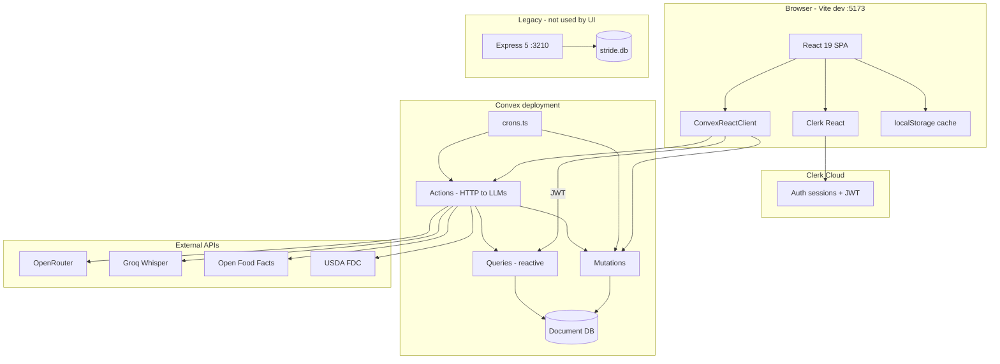
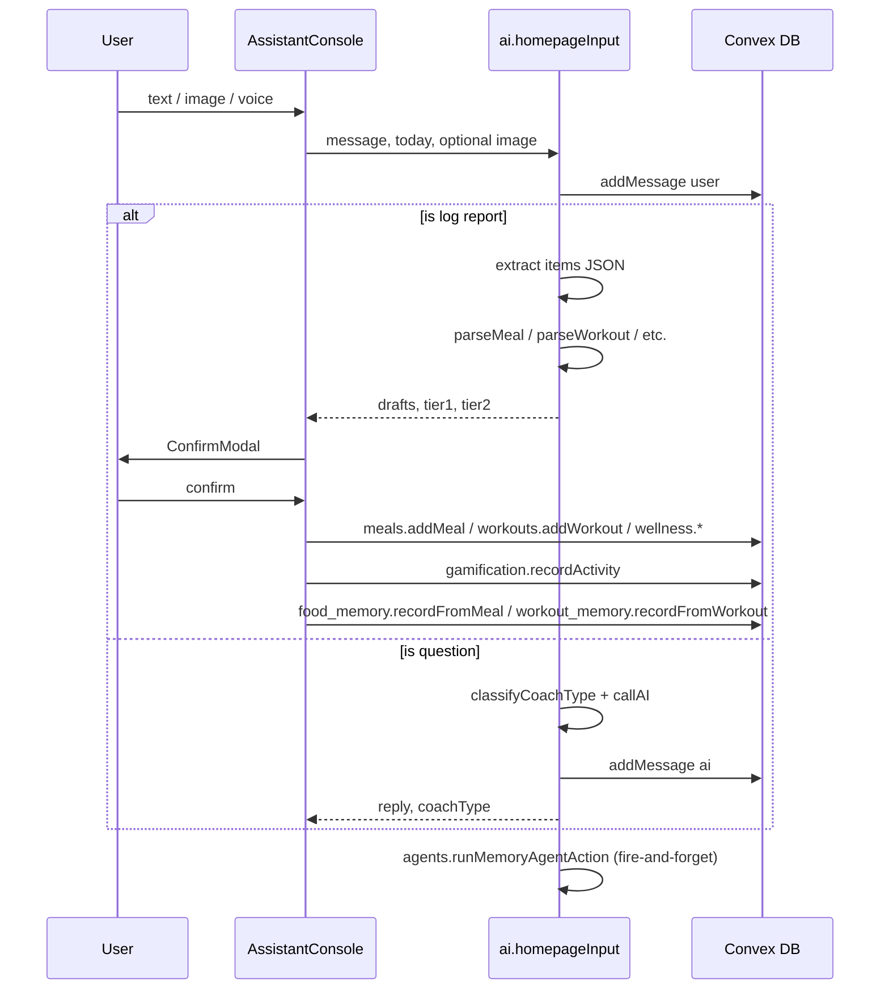
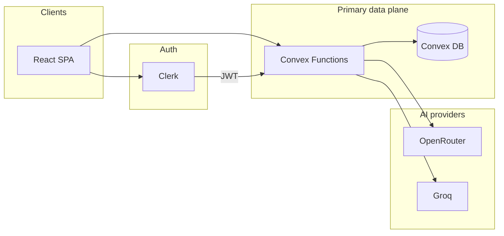
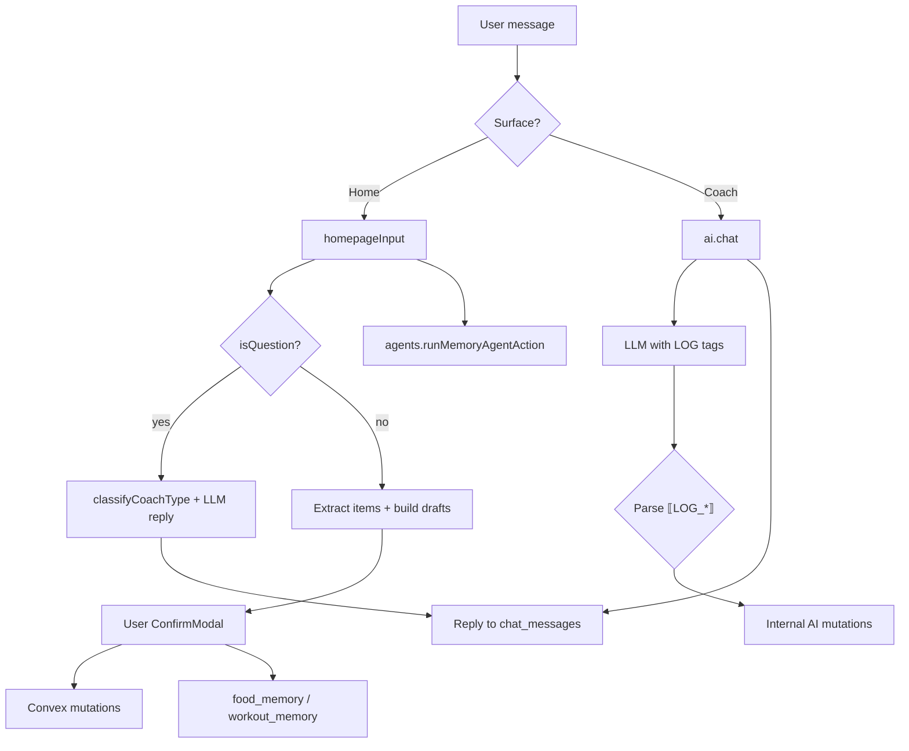

# Stride — System Reference (as implemented)

**Last verified against repository:** 2026-06-10
**Scope:** Describes how the product works in code today.

---

## Table of contents

1. [Product overview](#1-product-overview)
2. [High-level architecture](#2-high-level-architecture)
3. [Agent system](#3-agent-system)
4. [Flow-by-flow explanation](#4-flow-by-flow-explanation)
5. [Text tags, labels, and metadata](#5-text-tags-labels-and-metadata)
6. [Data model](#6-data-model)
7. [APIs and interfaces](#7-apis-and-interfaces)
8. [Operational behavior](#8-operational-behavior)
9. [Graphify / flow diagrams](#9-graphify--flow-diagrams)
10. [Gaps and risks](#10-gaps-and-risks)

---

## 1. Product overview

### What the product is

**Stride** is a web application for daily nutrition, workout, and wellness tracking with an AI coaching layer. Users log meals, workouts, water, sleep, mood, and steps; view progress and patterns; and interact with specialist AI coaches that can answer questions and write logs on their behalf.

### Core purpose and end goal

Reduce friction in health logging (natural language, photos, barcode, recipes) while giving personalized, data-aware guidance (macros, TDEE plan, daily brief, insights, nudges). The implementation targets an **adaptive wellness companion**: proactive nudges, behavioral memory, and multi-coach routing—not only a static dashboard.

### Main user types or roles

| Role | Implementation |
|------|----------------|
| **End user (athlete)** | Any signed-in Clerk user; no admin or coach-staff roles in code |
| **Anonymous** | Redirected to `/sign-in`; Convex handlers throw `Unauthenticated` without JWT |

There is **no** role-based access control beyond “signed in or not.”

### Main problems it solves

- **Logging friction:** Text/voice/image/barcode/recipe → structured Convex rows with macro estimates.
- **Context-aware coaching:** Chat uses profile, today's logs, 7-day calorie trend, dietary constraints, and behavioral signals.
- **Goal personalization:** Onboarding runs a 4-component TDEE engine (`tdee_engine.ts`) and stores targets on `user_profiles` / `daily_goals`.
- **Consistency:** Gamification (XP, streaks, missions), window-based home brief (`insights.getTodayBrief`), and cron-driven nudges/insights.
- **Accuracy layers:** Deterministic nutrition (`nutrition_engine.ts`) and workout calorie (`calorie_engine.ts` + `exercise_db.ts`) pipelines behind AI parsing.
- **Adaptive memory:** Auto-learned food memory (`food_memory`), workout memory (`workout_memory`), and personal ingredient memory (`user_ingredients`) improve accuracy over time.

---

## 2. High-level architecture

### Runtime boundaries



| Layer | Technology | Role today |
|-------|------------|------------|
| **Frontend** | React 19, TypeScript, Vite 6, Tailwind v4, Motion, React Three Fiber (voxel mascots) | All product UI; **only** talks to Convex via `convex/react` |
| **Auth** | Clerk (`@clerk/react` + `ConvexProviderWithClerk`) | Sign-in/up; JWT validated by Convex (`auth.config.ts`) |
| **Primary backend** | Convex (`backend/convex/`) | Database + server functions + crons + AI orchestration |
| **Legacy backend** | Express 5 + `better-sqlite3` (`backend/src/`) | Parallel REST API; **not called** by current frontend (no `apiFetch` usage) |
| **AI** | OpenRouter — split-model: parsing/extraction `openai/gpt-4o-mini` (`DEFAULT_MODEL`), chat replies `anthropic/claude-sonnet-4.6` (`CHAT_MODEL`), retry fallback `anthropic/claude-haiku-4.5` (`FALLBACK_MODEL`) | Chat, parsing, insights, vision |
| **Voice** | Groq `whisper-large-v3-turbo` | `api.ai.transcribe` (Convex env `GROQ_API_KEY`) |
| **Queues** | **Not found in code** | No Redis/SQS; Convex scheduler + crons only |
| **Object storage** | **Not found in code** | Images sent as base64 data URLs to OpenRouter |

### How major parts connect

1. `frontend/src/main.tsx` boots Clerk + Convex with `VITE_CONVEX_URL` and `VITE_CLERK_PUBLISHABLE_KEY`.
2. `App.tsx` calls `api.users.ensureUser` after sign-in; `OnboardingGuard` redirects incomplete profiles to `/onboarding`.
3. Pages use `useQuery` / `useMutation` / `useAction` against `api.*` modules under `backend/convex/`.
4. User identity in almost all tables is **`identity.subject`** (Clerk user id string), not the Convex `users` document `_id`.

### Environment and deployment assumptions

| Variable | Where | Purpose |
|----------|-------|---------|
| `VITE_CLERK_PUBLISHABLE_KEY` | `frontend/.env.local` | Clerk UI |
| `VITE_CONVEX_URL` | `frontend/.env.local` | Convex client URL |
| `CLERK_JWT_ISSUER_DOMAIN` | Convex dashboard | JWT issuer for `auth.config.ts` |
| `OPENROUTER_API_KEY` | Convex deployment (+ optional per-user in `user_settings`) | LLM calls |
| `GROQ_API_KEY` | Convex deployment | Transcription |
| `CONVEX_DEPLOYMENT`, `CONVEX_URL` | `backend/.env.local` | `npx convex dev` / deploy |
| `OPENROUTER_API_KEY`, `PORT` | `backend/.env.local` | Legacy Express only |

**Port conflict:** `backend/.env.example` and Express default use **3210**; Convex local dev also commonly uses 3210. The live UI expects **Convex**, not Express (`bun run dev` in `backend/package.json` starts Express only).

**Package managers:** `README.md` mentions npm; `AGENTS.md` and lockfiles use **bun**.

---

## 3. Agent system

Stride does **not** use separate autonomous agent processes or a supervisor LLM. “Agents” are **coach personas** (system prompts + routing) plus **orchestration actions** in `backend/convex/ai.ts` and `agents.ts`.

### Coach personas (`backend/convex/coaches.ts`)

| `CoachType` | UI name | Animal / voxel | Domain |
|-------------|---------|----------------|--------|
| `overall` | Stry | Elephant | Holistic wellness; default |
| `diet` | Panda | Panda | Nutrition, macros, meals |
| `workout` | Fox | Fox | Training, programming |
| `recovery` | Bear | Bear | Sleep, recovery, mobility |
| `water` | Axolotl | Axolotl | Hydration |
| `habit` | Mouse | Mouse | Consistency, habits |
| `mindset` | Unicorn | Unicorn | Mood, mindfulness |

Each coach exports a `systemPrompt` and `tagline`. `getCoach(type)` returns config; unknown types fall back to `overall`.

### MemoryAgent (`backend/convex/agents.ts`)

`agents.ts` contains a single implemented agent. (Earlier Phase 5 stubs — DietAgent, WorkoutAgent, SleepAgent, CoachAgent — were removed 2026-06-10 as unwired dead scaffolding; real multi-agent orchestration will be reintroduced when built, not stubbed.)

| Agent | Status | Description |
|-------|--------|-------------|
| **MemoryAgent** | ✅ **Implemented** | Extracts user-stated food/ingredient facts and aliases from messages; silently patches `food_memory` and `user_ingredients` |

MemoryAgent runs as a fire-and-forget internal action (`runMemoryAgentAction`) on every homepage input. It scans for phrases like "my homemade paneer has 18g protein per 100g" and persists them to `user_ingredients` or `food_memory`.

### How agents are triggered

| Entry point | Trigger | Routing |
|-------------|---------|---------|
| **Home** `AssistantConsole` | User message → `api.ai.homepageInput` | If log-like: extract items → drafts + confirm modal; if question: short coach reply via `classifyCoachType` |
| **Coach** `CoachPage` | User message → `api.ai.chat` with `coachType: "auto"` | Keyword scoring + `applyBehaviorBias`; optional `LOG_*` blocks auto-persist |
| **Onboarding** | `api.ai.parseOnboarding` | Field-specific NL parsing (not coach routing) |
| **Insights / crons** | Scheduled / manual actions | Generic prompts, not persona-specific |

Frontend maps `coachType` → voxel `Agent` id in `coachToAgent()` (`AssistantConsole.tsx`, `CoachPage.tsx`): e.g. `recovery` → `sleep`, `mindset` → `wellness`.

### How agents communicate

- **No inter-agent messaging.** A single OpenRouter completion runs per user turn with one chosen coach system prompt.
- **Shared context** is assembled in `ai.chat` / `homepageInput`: profile, today's meals/workouts, goals, behavior summary, session history (coach page / homepage session), **food memory**, **workout memory**, and **user ingredients**.
- **Behavioral memory** (`behavior.ts`): `recordBehavior` rows aggregated into `getBehaviorProfile` → injected via `behaviorSummary()` and `applyBehaviorBias()` on keyword scores.

### Task ownership

| Task | Owner module | Notes |
|------|--------------|-------|
| Coach reply text | `ai.ts` + `coaches.ts` | OpenRouter |
| Meal macro resolution | `ai.ts` → `nutrition_engine.ts` + `foods.ts` | After `parseMealDescription` |
| Workout calories | `ai.ts` → `calorie_engine.ts` + `exercise_db.ts` | Uses metabolic profile when available |
| Direct log tags in chat | `ai.chat` | Parses `LOG_*` and calls internal mutations |
| Homepage confirm flow | `homepageInput` + frontend `ConfirmModal` | User confirms before `meals.addMeal`, etc. |
| Daily brief copy | `insights.getTodayBrief` | **Deterministic** rules, not LLM |
| Pattern strings | `patterns.getPatterns` | **Deterministic** over 30 days |
| Nudge creation | `nudges.dispatchWindowNudges` (cron) | Template copy per window |
| Memory extraction | `agents.ts` `runMemoryAgent` | LLM-based fact extraction from user messages |
| Food memory learning | `food_memory.ts` `recordFromMeal` | Smoothed averaging from logged meals |
| Workout memory learning | `workout_memory.ts` `recordFromWorkout` | Smoothed averaging from logged workouts |
| Ingredient memory | `user_ingredients.ts` `upsertIngredient` | Per-user custom ingredient facts |

### How agent output is consumed

- **Chat:** Stored in `chat_messages`; UI renders markdown (`Markdown` component).
- **Logs:** `loggedItem` from `ai.chat` or confirmed drafts from homepage → Convex tables → `useLogs` normalizes to `LogEntry[]`.
- **Insights:** JSON string array in `insights.content`; UI on Insights page.
- **Suggestions:** `aiSuggestion` on meal rows; `regenerateSuggestion` action can refresh.
- **Memory:** Silent persistence to `food_memory`, `workout_memory`, `user_ingredients` — no direct UI feedback.

### Shared state, memory, session handling

| Mechanism | Storage | Used for |
|-----------|---------|----------|
| Clerk session | Clerk | Auth only |
| `chat_sessions` / `chat_messages` | Convex | Coach threads; homepage uses title `__HOMEPAGE_${today}__` (per-day session, hidden from session list) |
| `user_behavior` | Convex | Engagement, nudge dismissals, suggestions, coach usage, **check-in answers** |
| `localStorage` `stride.behavior.v1` | Browser | Offline cache + window fatigue (`useBehavior`) |
| `user_settings` | Convex | Coaching style, units, timezone offset, OpenRouter overrides |
| `user_profiles.planBreakdown` | Convex | Serialized `NutritionPlan` for dynamic day adjustment |
| `food_memory` | Convex | Auto-learned meal profiles (smoothed macros, aliases) |
| `workout_memory` | Convex | Auto-learned workout profiles (duration, intensity, calories) |
| `user_ingredients` | Convex | User-stated custom ingredient nutrition (per-100g) |

### Error handling, retries, fallbacks, escalation

**`callAI()` in `ai.ts`:**

- Up to **4 attempts**; attempts 3–4 use `FALLBACK_MODEL` (`anthropic/claude-haiku-4.5`).
- Retries on 5xx, 429, empty content, network errors, 60s abort.
- User-level keys: `user_settings.openRouterKey` / `openRouterModel` override deployment default.

**Log parsing from coach:**

- Per-item `try/catch`; failures logged with `console.error`; user still gets `cleanReply` without that log.

**Homepage intent:**

- Regex `looksLikeLog()` + forced second LLM pass if model returns `isQuestion: true` with no items.

**Transcription:**

- Requires `GROQ_API_KEY`; 30s timeout; throws on failure (no fallback provider in code).

**Escalation / human handoff:** **Not found in code.**

### Orchestration / supervisor logic

- **Crons** (`crons.ts`): fan-out daily insights and weekly summaries to “active” users (`behavior.listActiveUsers`, last 3 days); hourly window nudges.
- **No** LangGraph, CrewAI, or multi-step agent supervisor.
- **MemoryAgent** runs fire-and-forget on every homepage input via `internal.agents.runMemoryAgentAction`.

---

## 4. Flow-by-flow explanation

### 4.1 Authentication and bootstrap

| Step | Component |
|------|-----------|
| User opens app | `main.tsx` → `ClerkProvider` → `ConvexProviderWithClerk` |
| Signed out | Routes: `/sign-in`, `/sign-up`, `/sso-callback` |
| Signed in | `EnsureUser` → `api.users.ensureUser` inserts `users` row if new (`clerkId` = `identity.subject`) |
| Onboarding guard | `api.profile.getProfile`; missing or `onboardingComplete !== true` → `/onboarding` |

**State changes:** `users` table (metadata only); profile created at end of onboarding.

**Failures:** Missing env vars throw at startup (`main.tsx`). Convex calls fail → console error on `ensureUser`.

---

### 4.2 Onboarding and nutrition plan

| Step | Detail |
|------|--------|
| **Trigger** | User lands on `OnboardingPage.tsx` (multi-phase UI: name, stats, goal, work, lifestyle, training, diet, style, plan) |
| **Inputs** | Weight, height, age, sex, body fat, occupation, lifestyle, weekly workouts JSON, goal enum, diet prefs |
| **Compute** | `api.profile.calculateNutritionPlan` (query) → `computePlan()` in `profile.ts` using `tdee_engine.ts` |
| **Persist** | `api.profile.upsertPlanFromOnboarding` → `user_profiles` + seed `daily_goals` for chosen date |
| **AI assist** | `api.ai.parseOnboarding` for free-text field extraction |
| **Output** | Macro targets, `planBreakdown` JSON on profile |

**Side effects:** `onboardingComplete: true`; settings coaching style may be saved via `upsertSettings`.

**Failures:** Invalid enum values rejected in `upsertSettings`; plan compute requires authenticated user.

---

### 4.3 Home quick input (primary logging UX)



| | |
|-|-|
| **Trigger** | Send in `AssistantConsole` |
| **Services** | `homepageInput`, `chat.getHomepageMessages`, wellness/meals mutations |
| **Outputs** | Drafts for confirmation; or coach reply; messages in `__HOMEPAGE_${today}__` session |
| **Failure** | Toast “Couldn't reach Stry”; local message not rolled back on server (user message already saved) |

**Practice notes:**
- Homepage **requires confirm** before writes; `ai.chat` on Coach page can write immediately via `LOG_*` tags.
- Homepage sessions are **per-day** (`__HOMEPAGE_${today}__`), so each calendar day starts fresh.
- Confirm cards are **deterministic** — every log produces a visible confirm card, no silent auto-apply.
- MemoryAgent runs fire-and-forget after every input to extract user-stated facts.

---

### 4.4 Coach page (full chat)

| Step | Detail |
|------|--------|
| **Trigger** | Message in `CoachPage.tsx` |
| **Pre-check** | `DRAFT_TRIGGERS` in `frontend/src/data/mock.ts` still serves **demo** canned drafts for specific phrases (bypasses AI) |
| **Session** | `api.chat.createSession` if none; `api.ai.chat` with `sessionId`, `coachType: "auto"` |
| **Context load** | Profile, today meals/workouts, 7-day calories, behavior profile, history, **food memory**, **workout memory**, **user ingredients** |
| **Coach pick** | `classifyCoachType(message, behavior.preferredCoach)` unless fixed coach |
| **Logging** | Model appends `LOG_MEAL` etc.; server strips from reply and runs parsers + mutations |
| **Output** | `{ reply, loggedItem, coachType }`; UI toast on logged items |

**Failures:** Generic assistant error message; session title fallback to truncated user text if title LLM fails.

---

### 4.5 Manual / quick log (non-AI)

| Path | Flow |
|------|------|
| `QuickLogBar` | Recent foods, recipes → `meals.addMeal` or `recipes.logRecipe` |
| `useLogs.add` | Routes category to `meals`, `workouts`, `wellness` mutations |
| `FoodSearch` | `foods.searchFoods` action (OFF → USDA → cache) |
| Barcode | `foods.lookupBarcode` |

`meals.addMeal` records `behavior` kind `log` / key `meal`. Gamification `recordActivity` called from UI on success.

---

### 4.6 Meal AI pipeline (estimate / log / chat)

1. **NL parse:** `parseMealDescription` (LLM JSON: ingredients, cooking method, portion scale).
2. **Nutrition engine:** `runNutritionEngine` — match ingredients via `foods.searchFoods` / cache, `computeNutrition`, cooking adjustments (`nutrition_engine.ts`).
3. **Food memory match:** `findBestMatch` from `food_memory_match.ts` — deterministic Jaccard similarity matching against user's `food_memory` entries. If `timesLogged >= AUTO_APPLY_MIN_LOGGED` (2), macros can be auto-applied.
4. **Persist:** `meals.addMeal` or `addMealFromAI` with `confidence`, `nutritionSource`, `structuredItems`, `ingredientBreakdown`.
5. **Learn:** `food_memory.recordFromMeal` updates smoothed averages (20% weight for new logs, 50% for corrections).

**Failure:** AI fallback macros in parse step; engine may partial-match foods.

---

### 4.7 Workout AI pipeline

1. **Parse:** `parseWorkoutDescription` (LLM + optional structured exercises).
2. **Score:** `workout_scorer.ts`, MET from `exercise_db.ts`.
3. **Calories:** `calculateWorkoutCalories` with user `metabolicFactor` from `calibration.ts`.
4. **Persist:** `workouts.addWorkout` / `addWorkoutFromAI`; `calibration.incrementWorkoutCount`.
5. **Learn:** `workout_memory.recordFromWorkout` updates smoothed averages (25% weight).
6. **Day goals:** Client may call `goals.syncDayAdjustment` after workout (carb absorption of burn delta per `tdee_engine.adjustCaloriesForDay`).

---

### 4.8 Daily brief (home guidance)

| | |
|-|-|
| **Trigger** | `useQuery(api.insights.getTodayBrief)` on `HomePage` |
| **Logic** | **Rule-based** in `insights.ts`: time window (morning/day/evening/night), sleep, protein pace, water, yesterday activity |
| **Output** | `{ window, headline, priority, nudge, command, checkIn, stats }` including `adjustedCalorieTarget` when `planBreakdown` exists |
| **Failure** | Defaults if no profile (2000 kcal, 90g protein) |

**Command section** (`command`):
- `doToday`: One actionable priority based on current state (protein, sleep, water, reflection)
- `recoverFrom`: What to recover from (e.g., short sleep, low protein yesterday)
- `ignoreToday`: What to NOT worry about today
- `tone`: `steady` | `recovery` | `momentum` | `light`

**Check-in questions** (`checkIn`):
- Window-aware quick questions (sleep, energy, breakfast, lunch, mood, workout, wind-down)
- **Suppressed** if user has already sent a message on the homepage today
- **Deduplicated** via `user_behavior` `kind: "checkin"` records per date
- Only unanswered questions are shown; max 3 per window

Not LLM-generated despite “AI insights” branding elsewhere.

---

### 4.9 Proactive nudges

| | |
|-|-|
| **Trigger** | Cron `hourly` → `nudges.dispatchWindowNudges` |
| **Eligibility** | Users in `activeUserIds(3)`; local hour from `user_settings.timezoneOffsetMinutes`; skip if window in `dismissedNudges` (7d) |
| **Dedupe** | `(userId, type, window, date)` |
| **UI** | `NudgeInbox` → `getActiveNudges`, `dismissNudge` → records `nudge_dismiss` behavior |

**Delivery:** `delivery: "in_app"` only; push fields exist but **no push sender found in code**.

---

### 4.10 Daily / weekly AI insights

| | |
|-|-|
| **Manual** | `api.ai.generateDailyInsights`, `generateWeeklySummary` (authenticated actions) |
| **Cron** | 06:00 UTC daily → `cronDailyInsights`; Monday 07:00 UTC → `cronWeeklySummary` |
| **Fan-out** | Per active user, scheduler runs `generateDailyInsightsForUser` with **local date** from timezone offset |
| **Storage** | `insights.saveInsights`, `saveWeeklySummary` internal mutations |

---

### 4.11 Recipes

| | |
|-|-|
| **CRUD** | `recipes.ts` — `createRecipe`, `computeRecipeTotals` (pure) |
| **Log serving** | `logRecipe` → meal row scaled by servings |
| **AI** | `parseIngredients`, `parseSteps`, `recipeInsight` actions in `ai.ts` |

---

### 4.12 Patterns and history

- **`history.getCalendar` / `getDayHistory` / `getStreak`:** Aggregations for Insights/History UI.
- **`patterns.getPatterns`:** Deterministic strings (protein by DOW, sleep vs next-day workout, etc.).
- **`progress.getProgress`:** Chart series for Insights.

---

### 4.13 Gamification

- **`gamification.recordActivity`:** XP, streaks, missions (`MISSIONS` constant), streak freezes.
- Called from homepage confirm, quick log, recipes—not automatically from `ai.chat` direct logs (**inconsistency**).

---

### 4.14 Behavioral memory & adaptive layers

**Food memory (`food_memory`):**
- Auto-learns from every logged meal via `recordFromMeal`
- Stores smoothed averages (kcal, protein, carbs, fat), aliases, component strings
- `AUTO_APPLY_MIN_LOGGED = 2` — meals logged ≥2 times can be auto-matched
- `MATCH_THRESHOLD = 0.55` — Jaccard word similarity for matching
- Correction weight: 50% (user-corrected values override faster)
- New log weight: 20%

**Workout memory (`workout_memory`):**
- Auto-learns from every logged workout via `recordFromWorkout`
- Stores smoothed duration, intensity, calories, exercise list
- Same alias system as food memory

**Personal ingredient memory (`user_ingredients`):**
- Stores user-stated custom ingredients with per-100g nutrition
- Extracted automatically by MemoryAgent from messages like "my homemade paneer has 18g protein per 100g"
- Used in nutrition engine context for better matching
- Source: `user_stated` or `corrected`

---

## 5. Text tags, labels, and metadata

### 5.1 AI log markers (coach auto-log)

Defined in `ai.chat` system prompt (`backend/convex/ai.ts`). The model must emit these **exact** delimiters:

| Tag | JSON payload | Persisted via |
|-----|----------------|---------------|
| `LOG_MEAL` … `/LOG_MEAL` | `description`, `mealType`, `time`, optional `date` | `parseMealDescription` → `meals.addMealFromAI` |
| `LOG_WORKOUT` | workout description, optional `date` | `parseWorkoutDescription` → `workouts.addWorkoutFromAI` |
| `LOG_SLEEP` | `hours`, `quality`, optional `date` | `wellness.upsertSleep` |
| `LOG_WATER` | `ml`, optional `date` | `wellness.addWater` |
| `LOG_MOOD` | `rating`, `note`, optional `date` | `wellness.addMood` |
| `LOG_STEPS` | `count`, optional `date` | `wellness.upsertSteps` |

Server strips tags from user-visible `reply`. Multiple blocks per message supported.

### 5.2 Homepage extraction types

`homepageInput` LLM returns `items[].type` ∈ `meal | workout | sleep | water | mood | steps` (not the `` wire format).

### 5.3 Coach routing keywords

`KEYWORDS` map in `coaches.ts` — extensive English token lists per `CoachType`. Scores count substring matches; `overall` has no keywords. `applyBehaviorBias` adds **+0.5** to `preferredCoach` when tied/ambiguous.

### 5.4 Behavioral memory `kind` values

| `kind` | Typical `key` | Written by |
|--------|---------------|------------|
| `engagement` | `morning` \| `day` \| `evening` \| `night` | `useBehavior.recordEngagement` |
| `nudge_dismiss` | window name or nudge type | `dismissNudge`, `useBehavior.dismiss` |
| `suggestion` | chip label | `recordSuggestion`, QuickLogBar |
| `coach` | coach id | **Not found wired in frontend** (tests only) |
| `log` | `meal` | `meals.addMeal` |
| `checkin` | question id (e.g. `morning_sleep`, `evening_mood`) | `behavior.recordBehavior` in `getTodayBrief` |

### 5.5 Nudge `type` / `status` / `window`

- **Types:** `window_morning`, `window_day`, etc. (`nudges.ts` `WINDOW_NUDGES`).
- **Status:** `active` \| `dismissed`.
- **Window:** `morning` \| `day` \| `evening` \| `night` (aligned with `getTodayBrief` and `windowForHour`).

### 5.6 Profile / goal / wellness enums

| Field | Values (from schema / code) |
|-------|-----------------------------|
| `goal` (engine) | `aggressive_loss`, `moderate_loss`, `mild_loss`, `maintain`, `recomp`, `lean_gain`, `muscle_gain` |
| `occupationType` | `desk`, `mixed`, `standing`, `physical` |
| `lifestyleActivity` | `sedentary`, `light`, `moderate`, `active` |
| `coachingStyle` | `gentle`, `motivating`, `analytical` |
| `sleep.quality` | `poor`, `ok`, `good`, `great` |
| `workout.intensity` | Stored as string; AI maps to EASY/MODERATE/HIGH etc. |
| `units` | `metric`, `imperial` |

### 5.7 Chat session markers

- Homepage session title: **`__HOMEPAGE_${today}__`** (per-day) — filtered out of `getSessions` list (`chat.ts`).
- Message `role`: `user` \| `ai` (AI stored as `ai`, mapped to OpenAI `assistant`).

### 5.8 Frontend-only labels

- `Agent` type in `frontend/src/lib/storage.ts`: `main`, `diet`, `workout`, `sleep`, `water`, `habit`, `wellness` (UI/voxel; maps from backend coach types).
- `dailyTargets` in `frontend/src/data/mock.ts` still used for **Today's Pulse** progress bars on Home (may diverge from server targets).

### 5.9 Legacy Express coach set

`backend/src/coaches.ts` defines **5** coaches (includes legacy names like NutriBot-style copy). **Not used** by Convex path. Convex `coaches.ts` is authoritative for production.

---

## 6. Data model

### 6.1 Identity model (important)

| Concept | Value |
|---------|-------|
| Clerk user id | `ctx.auth.getUserIdentity().subject` |
| `userId` on meals, workouts, profiles, etc. | **Same as Clerk subject string** |
| `users` table | `clerkId` + email + name; `ensureUser` returns Convex `_id` but **logging tables do not reference it** |

### 6.2 Tables (Convex `schema.ts`)

| Table | Persistent | Purpose |
|-------|------------|---------|
| `users` | Yes | Clerk linkage |
| `meals` | Yes | Daily nutrition logs |
| `workouts` | Yes | Training logs + calorie engine fields |
| `daily_goals` | Yes | Per-day macro/calorie targets (incl. dynamic adjustment) |
| `insights` | Yes | Daily AI insight JSON |
| `weekly_summaries` | Yes | Weekly AI narrative |
| `user_profiles` | Yes | Body stats, targets, onboarding, `planBreakdown` |
| `user_settings` | Yes | OpenRouter overrides, UI prefs, timezone |
| `chat_sessions`, `chat_messages` | Yes | Coach + homepage threads |
| `food_cache` | Yes | Search/barcode cache with search index |
| `user_gamification` | Yes | XP, streaks, missions |
| `water_logs`, `sleep_logs`, `mood_logs`, `steps_logs` | Yes | Wellness |
| `user_metabolic_profiles`, `calorie_feedback` | Yes | Workout calorie calibration |
| `user_behavior` | Yes | Behavioral memory events |
| `nudges` | Yes | In-app inbox |
| `recipes` | Yes | User recipe builder |
| `food_memory` | Yes | Auto-learned meal profiles |
| `workout_memory` | Yes | Auto-learned workout profiles |
| `user_ingredients` | Yes | User-stated custom ingredient nutrition |

### 6.3 Key fields

**`meals`:** `calories`, `protein`, `carbs`, `fat`, `time`, `mealType`, optional `aiSuggestion`, `confidence`, `nutritionSource`, `structuredItems`, `ingredientBreakdown` (JSON strings), `foodMemoryId` (link to `food_memory` if auto-applied).

**`workouts`:** `sets`, `intensity`, optional `exercises` (any), `caloriesBurned`, `calorieConfidence`, `calorieRangeLow/High`, `calorieBreakdown`, `calculationVersion`, `structuredSets` (JSON).

**`user_profiles.planBreakdown`:** Serialized `NutritionPlan` from `tdee_engine` (includes `plannedDailyEAT` for day adjustment).

**`food_memory`:** `normalizedName`, `displayName`, `aliases`, `kcal`, `protein`, `carbs`, `fat`, `components`, `timesLogged`, `source` (`learned` | `corrected`), `lastUsedDate`.

**`workout_memory`:** `normalizedName`, `displayName`, `aliases`, `exercises`, `durationMin`, `intensity`, `caloriesBurned`, `timesLogged`, `lastUsedDate`.

**`user_ingredients`:** `normalizedName`, `displayName`, `caloriesPer100g`, `proteinPer100g`, `carbsPer100g`, `fatPer100g`, `notes`, `source` (`user_stated` | `corrected`), `lastUpdated`.

### 6.4 Validation (representative)

| Location | Rule |
|----------|------|
| `meals.addMeal` | Macros ≥ 0 |
| `goals.upsertDailyGoal` | Goals must be > 0 if provided |
| `profile.upsertSettings` | `units`, `coachingStyle` enums |
| `wellness` | Sleep hours, mood 1–5, water ml bounds in AI paths |
| `homepageInput` / log tags | Date regex `YYYY-MM-DD` |

### 6.5 Transient vs persistent

| Transient | Persistent |
|-----------|------------|
| OpenRouter/Groq HTTP responses | All Convex tables above |
| React component state, draft modals | `localStorage` prefs/behavior cache (write-through) |
| `ConfirmModal` queue | — |
| Graphify `graph.json` | — |

### 6.6 Legacy SQLite (`backend/src/db.ts`)

Mirrors core tables (users, meals, workouts, goals, insights, chat). Used **only** if Express routes run. Schema is **not** kept in parity with Convex (no `user_behavior`, `nudges`, `recipes`, wellness tables, food/workout memory, user ingredients, etc.).

---

## 7. APIs and interfaces

### 7.1 Convex public API (frontend contract)

Clients import `api` from `@convex/_generated/api` (browser shim → `anyApi`). Primary modules:

| Module | Queries | Mutations | Actions |
|--------|---------|-----------|---------|
| `users` | — | `ensureUser`, `clearAllData` | — |
| `meals` | `getMeals` | `addMeal`, `updateMeal`, `deleteMeal`, `relogMeal` | — |
| `workouts` | `getWorkouts`, `getTotalCaloriesBurned` | `addWorkout`, `updateWorkout`, `deleteWorkout`, `relogWorkout` | — |
| `wellness` | `getWater`, `getSleep`, `getMood`, `getSteps`, `getTodaySummary` | `addWater`, `upsertSleep`, `addMood`, `upsertSteps`, deletes | — |
| `goals` | `getDailyGoal` | `upsertDailyGoal`, `syncDayAdjustment` | — |
| `profile` | `getProfile`, `getSettings`, `calculateNutritionPlan` | `upsertProfile`, `upsertSettings`, `upsertPlanFromOnboarding` | `calculateTDEE` (legacy action) |
| `chat` | `getSessions`, `getMessages`, `getHomepageMessages` | `createSession`, `deleteSession`, `updateSessionTitle`, `clearAllMessages`, `clearHomepageMessages` | — |
| `ai` | `getCoaches` | — | `chat`, `homepageInput`, `estimateMeal`, `logMeal`, `logWorkout`, `parseMeal`, `parseWorkout`, `generateDailyInsights`, `generateWeeklySummary`, `suggestWorkout`, `transcribe`, `parseNutritionImage`, `parseOnboarding`, recipe helpers, … |
| `insights` | `getDailyInsights`, `getWeeklySummary`, `getTodayBrief` | — | — |
| `history` | `getCalendar`, `getDayHistory`, `getStreak`, `getHistoryInsights` | — | — |
| `progress` | `getProgress` | — | — |
| `patterns` | `getPatterns` | — | — |
| `foods` | `getRecentFoods` | — | `searchFoods`, `lookupBarcode` |
| `recipes` | `getRecipes` | `createRecipe`, `updateRecipe`, `deleteRecipe`, `logRecipe` | — |
| `gamification` | `getState` | `recordActivity`, `useStreakFreeze` | — |
| `nudges` | `getActiveNudges` | `dismissNudge` | — |
| `behavior` | `getBehaviorProfile` | `recordBehavior` | — |
| `calibration` | `getMetabolicProfile` | `submitCalorieFeedback`, `setFitnessLevel` | — |
| `food_memory` | `getKnownCount`, `getTopMemoriesPublic` | — | — |

**Auth:** All public functions expect Convex auth identity except where noted in tests/seed.

### 7.2 Internal-only functions

Used by actions/crons: `internal.*`, `internal.meals.addMealFromAI`, `internal.nudges.dispatchWindowNudges`, `internal.ai.cronDailyInsights`, `internal.agents.runMemoryAgentAction`, `internal.food_memory.recordFromMeal`, `internal.workout_memory.recordFromWorkout`, `internal.user_ingredients.upsertIngredient`, etc. Not callable from the browser.

### 7.3 Legacy Express REST (`backend/src/index.ts`)

Base URL: `http://localhost:${PORT}` (default 3210). All protected routes use `requireAuth` (Clerk). **Not used by current frontend.**

| Mount | Notable endpoints |
|-------|-------------------|
| `/api/auth` | `GET /me` |
| `/api/meals` | CRUD |
| `/api/workouts` | CRUD |
| `/api/goals` | `GET /` |
| `/api/progress` | `GET /` |
| `/api/insights` | `GET /daily`, `GET /weekly` |
| `/api/chat` | sessions + messages |
| `/api/ai` | `POST /chat`, `/estimate-meal`, `/daily-insights`, `/weekly-summary`, `/workout-suggestion`, `/log-meal`, `/log-workout`, `/transcribe`, … |
| `/api/profile` | `GET/POST /` |
| `/api/history` | calendar, day, insights |
| `/api/health` | health check |

### 7.4 Events / webhooks / jobs

| Mechanism | Schedule | Handler |
|-----------|----------|---------|
| Convex cron `daily insights` | 06:00 UTC | `internal.ai.cronDailyInsights` |
| Convex cron `weekly summary` | Mon 07:00 UTC | `internal.ai.cronWeeklySummary` |
| Convex cron `window nudges` | Hourly :00 UTC | `internal.nudges.dispatchWindowNudges` |
| Convex scheduler | Ad hoc 0 delay | Per-user insight generation |
| MemoryAgent | Fire-and-forget per homepage input | `internal.agents.runMemoryAgentAction` |

**Webhooks:** Not found in code.

---

## 8. Operational behavior

### 8.1 How the system runs today (development)

Typical dev (per `README.md` / Convex workflow):

```bash
cd backend && npx convex dev    # Convex backend + dashboard
cd frontend && npm run dev      # Vite on :5173
```

`backend/package.json` `dev` script runs **Express only** (`tsx --watch src/index.ts`) — insufficient for the React app unless Convex is started separately.

### 8.2 Startup sequence (browser)

1. Load env (`VITE_*`).
2. Clerk session restore.
3. Convex websocket connect with Clerk JWT.
4. `ensureUser` mutation.
5. Profile query → onboarding or `MainAppRoutes`.
6. Lazy-load `VoxelCanvas` inside signed-in layout.

### 8.3 Background jobs

See [§7.4](#74-events--webhooks--jobs). Active-user definition: behavior rows in last N days (`activeUserIds`).

### 8.4 Monitoring / logging / debug

- Server: `console.error` on AI log failures, Express global error handler logs stack.
- Client: `console.error` on `ensureUser` failure; toast errors on AI/network.
- **No** Sentry/Datadog integration found in code.
- Convex dashboard used for function logs (operational assumption, not in repo).

### 8.5 Rate limits and guardrails

| Guardrail | Location |
|-----------|----------|
| OpenRouter retries + fallback model | `ai.ts` `callAI` |
| OpenRouter 60s timeout | `callAI` |
| Groq 30s timeout | `transcribe` |
| Calorie floors / max deficit 25% | `tdee_engine.ts` |
| Nudge dedupe + dismiss throttle | `nudges.ts`, `deriveBehaviorProfile` |
| Homepage message cap 30 | `getHomepageMessages` |
| Coach history ~12 turns | `homepageInput` question path |
| Food memory auto-apply threshold | `food_memory_match.ts` `AUTO_APPLY_MIN_LOGGED = 2` |
| Food memory match threshold | `food_memory_match.ts` `MATCH_THRESHOLD = 0.55` |

**Explicit API rate limiting:** Not found in application code (relies on provider limits).

### 8.6 Deployment

- Convex: `cd backend && npm run deploy` (per README).
- Frontend: `vite build` static assets; hosting **not specified in repo**.
- Env secrets on Convex dashboard for production keys.

### 8.7 Tests

- `vitest` in `backend/` and `frontend/` (`convex-test`, RTL).
- Modules with tests include `behavior`, `nudges`, `crons`, `tdee_engine`, `recipes`, `patterns`, `coaches`, `settings`, `plan`, `profile`, `adjustment`, etc.

---

## 9. Graphify / flow diagrams

Source: `graphify-out/GRAPH_REPORT.md`, `graphify-out/graph.json`, `graphify-out/manifest.json` (snapshot **2026-05-01**). Graphify analyzed a **smaller corpus** (README, AGENTS, legacy Dashboard paths, Express routes) and is **partially stale** relative to the current Home/Coach split and Convex-first architecture.

### 9.1 Graphify summary statistics

- 129 nodes, 186 edges, 28 communities.
- 68% extracted, 31% inferred; 57 inferred edges (avg confidence 0.83).
- God nodes: `requireAuth()`, Express setup, `apiFetch()`, SQLite/Convex schema nodes, `callAI`, AI chat endpoint.

### 9.2 Architecture (aligned to current code)



### 9.3 Inferred hyperedges (verify before trusting)

Graphify grouped (confidence ~0.85–0.90):

- **Express CRUD route pattern** — meals/workouts/chat/profile routers.
- **AI OpenRouter feature suite** — `backend/src/routes/ai.ts` endpoints.
- **SQLite user-centric schema** — `db.ts` tables.
- **Authentication flow** — Clerk provider + protected UI (graph still names `Dashboard`).

Treat Express/SQLite hyperedges as **legacy** unless explicitly reviving that stack.

### 9.4 Ambiguous edges (from graph report)

| Edge | Issue |
|------|-------|
| `better-sqlite3` ↔ `Convex Generated DataModel` | Two storage layers; not synchronized |
| `AI Router` ↔ `Convex Generated API` | Parallel implementations |

### 9.5 Coach / logging flow (current implementation)



### 9.6 Knowledge gaps flagged by Graphify

- 36 isolated nodes (marketing names like “NutriBot 9000”, README-only concepts).
- Many single-node communities (vite config, generated types) — low structural insight.
- **Recommendation:** Use this document + `docs/TECH_STACK.md` for navigation; use graphify for legacy Express discovery only.

---

## 10. Gaps and risks

### 10.1 Documentation / repo drift

| Item | Risk |
|------|------|
| `README.md` | Says bcrypt token auth; **actual auth is Clerk** |
| `AGENTS.md` | Describes Express+SQLite as primary backend |
| `docs/TECH_STACK.md` | References `Dashboard.tsx`, tab shell — **replaced by** `HomePage`, `CoachPage`, router tabs |
| `graphify-out/` | Predates Convex-first home/coach split |
| `docs/SYSTEM.md` | Product vision, not implementation reference |

### 10.2 Dual backend

Maintaining `backend/src/` Express + SQLite alongside Convex risks confusion and schema drift. Frontend does not call Express today.

### 10.3 Identity / users table

`users` Convex documents are created but **not** FK-linked from `meals.userId` (Clerk subject used directly). Orphan or duplicate identity semantics if Clerk id ever changes.

### 10.4 Incomplete feature wiring

| Feature | Status |
|---------|--------|
| Web push for nudges | Schema `delivery` field only |
| `coach` behavior kind from UI | Not wired (only tests) |
| `CoachPage` `DRAFT_TRIGGERS` | Mock shortcuts still present |
| `syncDayAdjustment` | Exists; **not grep-found** on all workout log paths |
| Gamification on `ai.chat` auto-logs | May skip `recordActivity` |
| USDA API | Used in `foods.ts`; API key requirement **not documented** in `.env.example` |
| `calculateTDEE` action | Legacy; onboarding uses `calculateNutritionPlan` |
| Multi-agent orchestration | Only MemoryAgent implemented; Phase 5 stubs removed 2026-06-10 |

### 10.5 Timezone / window logic

- `getTodayBrief` uses **user timezone** (`timezoneOffsetMinutes` from settings) since recent update — **fixed** from server local hour.
- Nudge dispatch uses `timezoneOffsetMinutes` from settings — consistent with brief.
- Crons run on **UTC** wall clock; fan-out adjusts “today” per user offset for insights only.

### 10.6 AI reliability

- Keyword coach routing can misclassify multi-topic messages.
- Homepage and coach use **different** logging paths (confirm vs immediate tags).
- `getSettings` returns `openRouterKey` to client (masked as `hasOpenRouterKey` but key still in query handler return shape for server row) — review security if exposing query fields changes.

### 10.7 Technical debt

- Large monolith `ai.ts` (~1900+ lines).
- `users.clearAllData` incomplete vs schema (no `recipes`, `nudges`, `user_behavior`, `food_memory`, `workout_memory`, `user_ingredients`, etc.).
- Express coaches ≠ Convex coaches.
- Home “Today's pulse” uses `mock.ts` targets, not always `getTodayBrief.stats`.

### 10.8 Fragile areas

- OpenRouter/Groq availability — hard failures surface as user toasts.
- Image payloads as base64 in actions — size/latency limits unknown in code.
- OCC / concurrent updates: standard Convex retries; no custom conflict UX.

---

## Related files

| Document | Purpose |
|----------|---------|
| `docs/TECH_STACK.md` | Stack and Convex vs Express (partially outdated routes) |
| `docs/IMPLEMENTATION_PLAN.md` | Roadmap vs current schema (many items now implemented) |
| `docs/SYSTEM.md` | Long-term product vision |
| `graphify-out/GRAPH_REPORT.md` | Automated graph analysis snapshot |
| `README.md` | Quick start (verify auth/backend claims against this doc) |

---

## Quick reference: where to change behavior

| Want to change… | Start here |
|-----------------|------------|
| Coach personality / routing | `backend/convex/coaches.ts`, `ai.ts` |
| Home log vs chat | `ai.homepageInput`, `AssistantConsole.tsx` |
| Auto-log from coach | `ai.chat` `LOG_*` handlers |
| Daily home copy | `insights.getTodayBrief` |
| Macro / TDEE math | `tdee_engine.ts`, `profile.ts` |
| Workout calories | `calorie_engine.ts`, `calibration.ts` |
| Food search | `foods.ts`, `nutrition_engine.ts` |
| Nudges / crons | `nudges.ts`, `crons.ts` |
| Food memory / auto-learn | `food_memory.ts`, `food_memory_match.ts` |
| Workout memory | `workout_memory.ts` |
| Personal ingredient memory | `user_ingredients.ts`, `agents.ts` |
| Schema | `schema.ts` |
