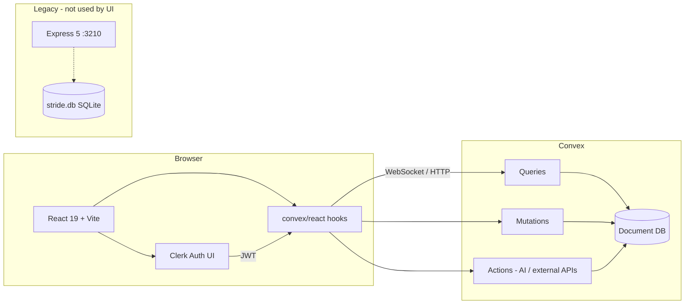

# Stride — Tech Stack & Architecture

This document describes how the **frontend** and **backend** are structured today, how routing works at each layer, what stores data, and how **Convex** fits in as the application’s primary backend.

---

## High-level architecture



| Layer | Role today |
| ----- | ---------- |
| **Frontend** | React SPA; all product data flows through Convex hooks |
| **Convex** | Database, auth-aware server functions, AI actions, real-time subscriptions |
| **Clerk** | Sign-in, sign-up, session; JWTs are passed to Convex |
| **Express + SQLite** | Legacy REST API and local `stride.db`; **not called by the current frontend** |

The live app path is: **Browser → Clerk → Convex**. The Express stack under `backend/src/` is retained from an earlier architecture and mirrors many of the same REST shapes, but `frontend/src/lib/api.ts` (`apiFetch`) is unused.

---

## Repository layout

```
stride/
├── backend/
│   ├── convex/           # Convex schema, queries, mutations, actions (primary backend)
│   └── src/              # Express routes, SQLite (legacy)
├── frontend/
│   └── src/              # React pages, tabs, components, lib
└── docs/
    └── TECH_STACK.md     # This file
```

---

## Database

### Primary: Convex (document database)

All tables are defined in `backend/convex/schema.ts` using Convex’s `defineSchema` / `defineTable` API. Examples:

| Table | Purpose |
| ----- | ------- |
| `users` | App user linked to Clerk (`clerkId` index) |
| `meals`, `workouts` | Daily logging |
| `daily_goals` | Calorie / macro targets per day |
| `user_profiles`, `user_settings` | Body stats, targets, optional OpenRouter overrides |
| `insights`, `weekly_summaries` | AI-generated copy |
| `chat_sessions`, `chat_messages` | AI coach threads |
| `food_cache` | Barcode / search nutrition cache (with search index) |
| `user_gamification` | XP, streaks, missions |
| `user_metabolic_profiles`, `calorie_feedback` | Calorie engine calibration |

Indexes (e.g. `by_user_date` on meals/workouts) support efficient per-user, per-day queries.

**Access pattern:** the frontend never talks to the DB directly. It calls Convex **queries** (read), **mutations** (write), and **actions** (side effects: HTTP to OpenRouter, Groq, etc.). Convex runs transactional reads/writes against these tables inside function handlers (`ctx.db.query`, `ctx.db.insert`, …).

### Legacy: SQLite (`better-sqlite3`)

- File: `backend/stride.db` (created next to the backend when Express runs).
- Schema: inline SQL in `backend/src/db.ts` (users, meals, workouts, goals, insights, chat, …).
- Used only by **Express route handlers** under `backend/src/routes/*.ts`.

This is **not** the database the React app uses anymore.

---

## Convex: database + server functions (not “DB only” in the strict sense)

Convex is the **only data store** for the production UI, but it also hosts **all server-side logic** that touches that data:

| Convex function type | Purpose in Stride | Frontend API |
| -------------------- | ----------------- | ------------ |
| `query` | Read data; reactive subscriptions | `useQuery(api.module.fn, args)` |
| `mutation` | Create/update/delete in transactions | `useMutation(api.module.fn)` |
| `action` | External HTTP (OpenRouter, Groq), heavy work | `useAction(api.module.fn)` |
| `internalQuery` / `internalMutation` | Private helpers between functions | Not exposed to client |

**File-based routing:** each file under `backend/convex/` is a module. A public function `getMeals` in `meals.ts` is referenced as `api.meals.getMeals`. Generated types live in `backend/convex/_generated/api.d.ts`.

**Auth:** `backend/convex/auth.config.ts` configures Clerk as a JWT provider (`CLERK_JWT_ISSUER_DOMAIN` in the Convex dashboard). Handlers typically resolve the user via `ctx.auth.getUserIdentity()` and use `identity.subject` as the Clerk user id (see `users.ensureUser`, `meals` helpers).

**Domain modules (Convex):**

| Module | Responsibility |
| ------ | ---------------- |
| `users` | Ensure Convex user row on login |
| `meals`, `workouts`, `goals` | CRUD and daily aggregates |
| `profile` | Profile, settings, TDEE helpers |
| `history`, `insights`, `progress` | Streaks, calendar, charts data |
| `chat` | Coach sessions and messages |
| `gamification` | XP, streaks, freezes |
| `foods` | Food search / barcode (with cache table) |
| `ai` | OpenRouter chat, parsing, insights, vision, transcription orchestration |
| `calorie_engine`, `nutrition_engine`, `exercise_db`, `workout_scorer`, `unit_converter`, `calibration` | Deterministic fitness/nutrition logic used by AI and logging |
| `coaches` | Coach personas for chat |

There is **no** `convex/http.ts` in this repo; Convex HTTP routes are not used. The client uses the Convex React client only.

**Running Convex locally:**

```bash
cd backend && bun run convex   # runs: npx convex dev
```

Set `VITE_CONVEX_URL` in `frontend/.env.local` to your deployment URL (local dev default in `.env.example`: `http://127.0.0.1:3210`).

---

## How routes are made

### 1. Frontend — React Router v7

Defined in `frontend/src/main.tsx`:

| Path | Component | Auth |
| ---- | ----------- | ---- |
| `/sign-in/*` | Clerk `<SignIn />` | Public |
| `/sign-up/*` | Clerk `<SignUp />` | Public |
| `/` | `Dashboard` inside `Layout` | `ProtectedRoute` |
| `/settings` | `Settings` inside `Layout` | `ProtectedRoute` |
| `*` | Redirect to `/` | — |

**Provider nesting (outer → inner):** `BrowserRouter` → `ClerkProvider` → `ConvexProviderWithClerk` → `ThemeProvider` → `Routes`.

**In-app navigation:** most of the product is **not** additional URL routes. `Layout` + `Dashboard` use tab state (`activeTab`: HOME, MEALS, WORKOUT, …) and render tab components from `frontend/src/components/tabs/`.

**Dev proxy:** Vite proxies `/api` → `http://localhost:3210` for optional legacy Express calls (`frontend/vite.config.ts`). The UI does not depend on this proxy today.

### 2. Legacy backend — Express 5 REST

Mounted in `backend/src/index.ts`:

| Mount prefix | Router file |
| ------------ | ----------- |
| `/api/auth` | `routes/auth.ts` |
| `/api/meals` | `routes/meals.ts` |
| `/api/workouts` | `routes/workouts.ts` |
| `/api/goals` | `routes/goals.ts` |
| `/api/progress` | `routes/progress.ts` |
| `/api/insights` | `routes/insights.ts` |
| `/api/chat` | `routes/chat.ts` |
| `/api/ai` | `routes/ai.ts` |
| `/api/profile` | `routes/profile.ts` |
| `/api/history` | `routes/history.ts` |
| `/api/health` | inline health check |

**Middleware chain:** `cors` → `express.json()` → `clerkMiddleware()` → `ensureUser` (sync Clerk user into SQLite) → route handlers → global error handler.

**Auth on Express:** `@clerk/express` `getAuth(req)`; `requireAuth` returns 401 if no Clerk session.

**Running Express:**

```bash
cd backend && bun run dev   # tsx --watch src/index.ts, default PORT 3210
```

Note: local Convex dev also commonly uses port **3210** per `backend/.env.example`. Only one service should bind that port; the **frontend is configured for Convex**, not Express.

### 3. Convex — function references (not HTTP paths)

Clients call functions by name, e.g.:

```ts
useQuery(api.meals.getMeals, { date: today })
useMutation(api.meals.addMeal)
useAction(api.ai.chat)
```

This replaces REST paths for all app features wired through `Dashboard`, `Settings`, and shared components.

---

## Authentication

| Concern | Implementation |
| ------- | ---------------- |
| UI & session | [@clerk/react](https://clerk.com/) — `ClerkProvider`, `SignIn` / `SignUp`, `useAuth`, `useUser` |
| Convex | `ConvexProviderWithClerk` + `convex/react-clerk` — attaches Clerk JWT to Convex requests |
| Convex server | `auth.config.ts` validates JWT; handlers use `ctx.auth.getUserIdentity()` |
| Legacy Express | `@clerk/express` `clerkMiddleware` + `requireAuth` |

**User record:** on load, `Dashboard` calls `api.users.ensureUser` to create/link a row in Convex `users` keyed by Clerk id.

---

## AI & external services

Handled primarily in **`backend/convex/ai.ts`** (and related actions in `foods.ts`, etc.):

| Service | Use |
| ------- | --- |
| **OpenRouter** | Chat, meal/workout parsing, insights, vision models |
| **Groq** | Voice transcription fallback (`GROQ_API_KEY` in Convex env) |

API keys can come from deployment env (`OPENROUTER_API_KEY`) or per-user overrides in `user_settings` (`openRouterKey`, `openRouterModel`).

Legacy duplicate logic also exists in `backend/src/routes/ai.ts` (Express + SQLite) for the old stack.

---

## Frontend tech stack

| Category | Technology | Notes |
| -------- | ------------ | ----- |
| Runtime / build | **Vite 8**, **TypeScript ~6** | `frontend/vite.config.ts` |
| UI library | **React 19** | `StrictMode`, function components |
| Routing | **react-router-dom 7** | See routes above |
| Auth | **@clerk/react** | Integrated with Convex |
| Data layer | **convex** + **convex/react** | `useQuery`, `useMutation`, `useAction`; imports `api` from `backend/convex/_generated/api` |
| Styling | **Tailwind CSS v4** | `@tailwindcss/vite` plugin; `@import "tailwindcss"` in `index.css` |
| Motion | **framer-motion** | Page/tab transitions, `AnimatePresence` |
| Icons | **lucide-react** | Nav and UI icons |
| Charts | **recharts** | History / insights visualizations |
| Markdown | **react-markdown** + **remark-gfm** | AI coach messages |
| Utilities | **clsx**, **tailwind-merge**, **class-variance-authority** | Class names / variants |
| Theming | Custom `ThemeProvider` (`lib/theme.tsx`) | Light/dark, accent colors (CSS variables) |
| Fonts | Google Fonts in CSS | Anton (headings), Work Sans (body), IBM Plex Mono |

**Important Vite detail:** `convex/server` is aliased to `src/lib/convex-server-stub.js` so shared types can be imported in the browser bundle without pulling Node-only Convex server code.

**Entry:** `frontend/src/main.tsx` (routing + providers). `App.tsx` is a stub; logic lives in pages and tabs.

**Key pages / areas:**

- `pages/Dashboard.tsx` — central Convex wiring, tab shell, onboarding
- `pages/Settings.tsx` — profile and OpenRouter settings via Convex
- `components/tabs/*` — feature UIs (meals, workouts, insights, history, AI coach, …)
- `components/*` — scanners, command bar, gamification, voice input, etc.

---

## Backend tech stack (summary)

| Component | Technology |
| --------- | ---------- |
| **Primary** | Convex 1.36, TypeScript |
| **Legacy API** | Express 5, tsx, cors, dotenv |
| **Legacy DB** | better-sqlite3 → `stride.db` |
| **Legacy auth** | @clerk/express |
| **Package manager** | bun (per project conventions) |

---

## Environment variables

### Frontend (`frontend/.env.local`)

| Variable | Purpose |
| -------- | ------- |
| `VITE_CONVEX_URL` | Convex deployment URL for `ConvexReactClient` |
| `VITE_CLERK_PUBLISHABLE_KEY` | Clerk frontend key |

### Backend / Convex (`backend/.env.local` + Convex dashboard)

| Variable | Purpose |
| -------- | ------- |
| `CONVEX_DEPLOYMENT` | Deployment id (from `npx convex dev`) |
| `CONVEX_URL` / `VITE_CONVEX_URL` | Convex URL (often `http://127.0.0.1:3210` locally) |
| `OPENROUTER_API_KEY` | Default AI key for Convex actions |
| `GROQ_API_KEY` | Transcription |
| `CLERK_JWT_ISSUER_DOMAIN` | Convex auth (dashboard) |
| `PORT` | Express only (legacy), default 3210 |

---

## Development commands

```bash
# Install
cd backend && bun install
cd frontend && bun install

# Convex backend (required for app data)
cd backend && bun run convex

# Frontend
cd frontend && bun run dev    # http://localhost:5173

# Legacy Express (optional; not used by current UI)
cd backend && bun run dev
```

```bash
cd frontend && bun run build   # production bundle
cd frontend && bun run lint
cd backend && bun run typecheck
```

---

## Data flow example (log a meal)

1. User submits meal in `MealsTab` / `Dashboard` handler.
2. Frontend calls `useMutation(api.meals.addMeal)` (or an AI `logMeal` action that writes internally).
3. Convex runs the mutation in a transaction: validates auth, `ctx.db.insert("meals", { userId, … })`.
4. All subscribed `useQuery(api.meals.getMeals, { date })` clients receive the updated list in real time.
5. Optional: `api.gamification.recordActivity` updates XP/streaks in the same session.

No Express or SQLite participates in this path.

---

## Documentation drift

Some project files still describe **Express + SQLite + token/bcrypt** auth (`AGENTS.md`, root `README.md` partially). The **implemented** stack for the UI is **Clerk + Convex**. Treat Express/SQLite as legacy unless you are explicitly maintaining or removing that layer.

---

## Related files (quick reference)

| Topic | Path |
| ----- | ---- |
| Convex schema | `backend/convex/schema.ts` |
| Generated API types | `backend/convex/_generated/api.d.ts` |
| Express entry | `backend/src/index.ts` |
| SQLite bootstrap | `backend/src/db.ts` |
| Frontend routing | `frontend/src/main.tsx` |
| Convex client setup | `frontend/src/main.tsx` |
| Main data wiring | `frontend/src/pages/Dashboard.tsx` |
